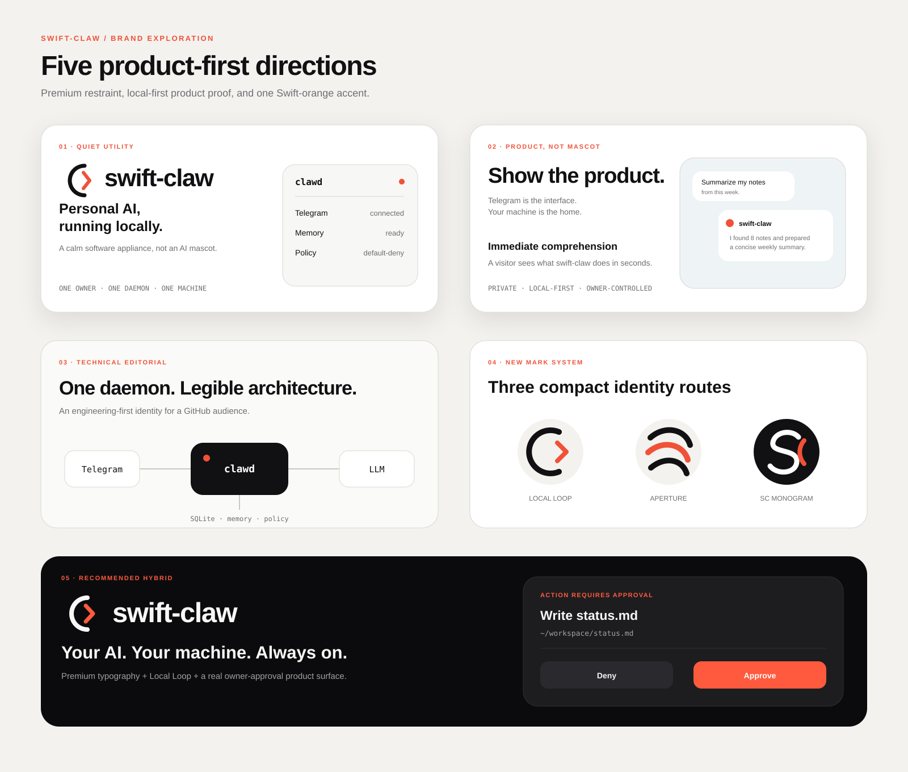
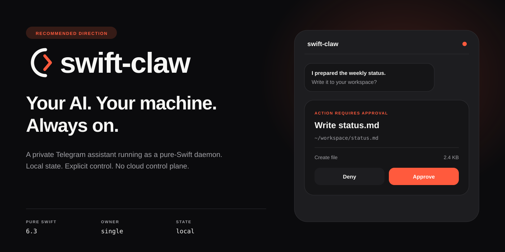
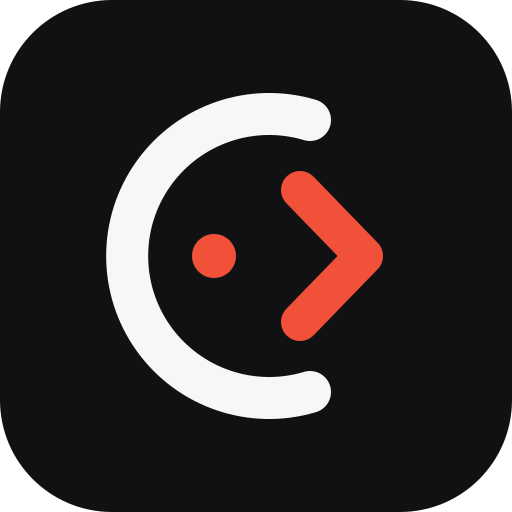
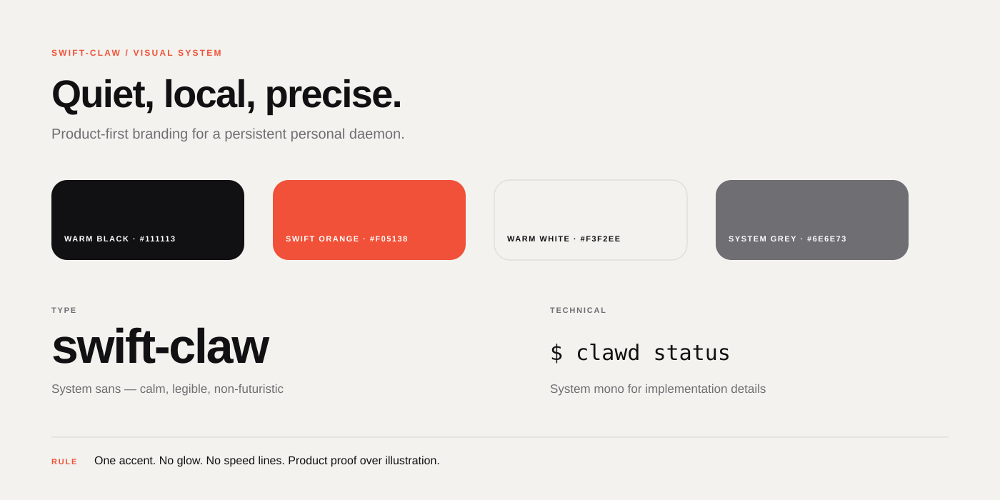

# swift-claw — premium brand exploration

This is a design-review artifact. The production README and existing branding remain untouched until a direction is selected.

## All directions

The board compares:

1. **Quiet Utility** — a calm local software appliance.
2. **Product, Not Mascot** — the Telegram experience as the hero.
3. **Technical Editorial** — the daemon architecture as the visual language.
4. **New Mark System** — Local Loop, Claw Aperture, and an SC monogram.
5. **Recommended Hybrid** — premium typography, Local Loop, and the owner-approval product surface.

## Recommended direction

The recommended route is **Recommended Hybrid + Local Loop**. It gives the repository a distinctive identity while grounding the hero in swift-claw's actual product: one owner, one local daemon, Telegram as the interface, durable local state, and explicit approval before consequential actions.

## Primary mark

## Visual system

## Deliverables in this review

- editable vector contact sheet with all five directions;
- standalone recommended hero at 1400×700;
- standalone Local Loop mark at 512×512;
- visual-system board with palette, typography, and usage rule.

The raster export package (README sizes, social cards, and light/dark avatars) is intentionally kept separate from the production branding until a direction is approved. No production asset or README reference is replaced by this PR.
